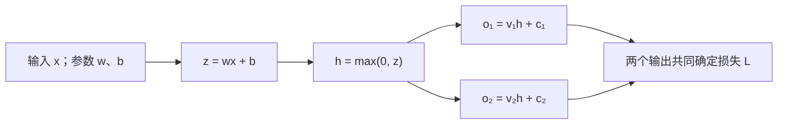

---
aliases:
  - 反向传播算法
  - 误差反向传播
  - 反传
  - 反向傳播
  - Backpropagation
  - Back propagation
  - Back-propagation
  - Backprop
natural-links: false
---

# 反向传播

反向传播（Backpropagation）是计算[[神经网络]]中[[梯度]]的一种算法。它从最终的损失出发，沿计算的依赖关系反向求导，得到损失对各个[[模型参数|参数]]的影响程度，为调整[[模型参数|参数]]提供依据。它计算的是当前位置的导数；[[模型参数|参数]]怎样更新，则由后续的优化方法决定。

反向传播以[[链式法则]]为数学依据，关键在于安排求导的顺序，并复用已经得到的中间结果。一个网络可以有许多[[模型参数|参数]]，但通常只需要优化一个标量目标；从这个目标向前反推，可以在一次反向过程中得到所有相关[[模型参数|参数]]的[[梯度]]。这一机制既适用于逐层连接的网络，也适用于包含分支、共享变量等结构的可微计算。

## 求导对象与作用

设模型以输入 $x$ 和[[模型参数|参数]] $\theta$ 计算预测 $f_\theta(x)$，再用[[损失函数]]评价预测与目标 $y$ 的差异。本次求导的目标为：

$$
L(\theta)=\ell(f_\theta(x),y).
$$

这里的 $\theta$ 代表全部可学习的[[模型参数|参数]]，可以包括许多层的权重和偏置。在一次求导中，输入和目标通常保持固定，反向传播要计算的是 $\nabla_\theta L$，也就是损失对每个[[模型参数|参数]]的[[偏导数]]组成的[[梯度]]。

若某个[[模型参数|参数]]为 $w$，它的[[偏导数]]表示：其他[[模型参数|参数]]暂时不变时，$w$ 的微小变化会怎样影响损失。在可微位置附近，这种变化可以近似写为：

$$
L(w+\Delta w)\approx L(w)+\frac{\partial L}{\partial w}\Delta w.
$$

导数为正，表示小幅增大 $w$ 会使损失上升；导数为负，表示小幅增大 $w$ 会使损失下降。这是局部信息，不能据此保证任意大的调整都有效。

反向传播对多层网络尤其重要，因为训练目标往往只规定最终输出，并不直接规定每个内部单元应该输出什么。它把最终目标对内部计算的敏感程度逐步算出来，使中间层的[[模型参数|参数]]也能依据同一个目标调整。因此，隐藏在输出之前的表示可以参与学习，而不必为每个内部单元单独提供一个正确答案。

## 计算原理

### 局部导数的组合

[[神经网络]]的计算可以拆成许多相互依赖的运算，并用[[计算图]]表示。图中的节点是输入、[[模型参数|参数]]或中间结果，箭头表示一个量参与了另一个量的计算。[[前向传播]]顺着这些依赖关系计算数值；反向传播则利用这些数值，按相反的依赖顺序计算导数。

考虑一段计算 $u\rightarrow v\rightarrow L$，其中 $v=f(u)$。$u$ 对损失的影响，要经过它对 $v$ 的影响以及 $v$ 对损失的影响。[[链式法则]]将两者连接起来：

$$
\frac{\partial L}{\partial u}
=
\frac{\partial L}{\partial v}
\frac{\partial v}{\partial u}.
$$

式中 $\partial v/\partial u$ 是当前这一步运算的局部导数，而 $\partial L/\partial v$ 已经概括了从 $v$ 到最终损失的后续影响。只要后者已经求出，处理 $v=f(u)$ 时就不必重新展开后面的全部计算。这是反向传播复用中间结果的基本方式。

例如，若 $v=wu+b$，并且已经知道损失对 $v$ 的导数为 $g$，就能用这个结果继续求它对 $w$、$b$、$u$ 的导数：

$$
\frac{\partial L}{\partial w}=gu,\qquad
\frac{\partial L}{\partial b}=g,\qquad
\frac{\partial L}{\partial u}=gw.
$$

同一个 $g$ 同时用于这些计算；运算本身只需提供它对各个输入的局部导数。整个网络的求导因而可以由每一步运算各自承担的一小段计算组合而成。

### 多条依赖路径的合并

一个量可能被后面的多个运算使用。例如，某个隐层输出同时进入两个预测分支，它就通过两条路径影响最终损失。这时不能只沿其中一条路径求导，也不能用后计算的贡献覆盖先计算的贡献，而要把各条路径的贡献相加。

设 $u$ 被直接用于计算 $v_1,\ldots,v_m$，损失通过这些结果依赖于 $u$，则多变量的[[链式法则]]给出：

$$
\frac{\partial L}{\partial u}
=
\sum_{j=1}^{m}
\frac{\partial L}{\partial v_j}
\frac{\partial v_j}{\partial u}.
$$

这里每个 $\partial L/\partial v_j$ 都已包含该分支后面的影响。反向传播先把来自各个后续运算的贡献累加到 $u$，再用合并后的导数继续处理产生 $u$ 的运算。多条路径可能加强彼此的影响，也可能部分抵消；相加反映的是它们对同一个目标的共同作用。

据此，一次反向传播可以概括为以下计算过程：

1. 完成[[前向传播]]，获得最终损失，并保留反向求导会用到的中间值与依赖关系。
2. 从损失本身开始，令 $\partial L/\partial L=1$；其他待累加的导数初始为零。
3. 按依赖关系的反向顺序处理运算，将其输出对损失的导数与局部导数组合，累加到各个输入。一个中间量的后续贡献收集完整后，才继续向它的来源传递。
4. 到达可学习的[[模型参数|参数]]时，得到各个[[偏导数]]，合起来就是本次目标的[[梯度]]。

“反向”指求导所采用的依赖顺序，并不表示把网络的前向函数求逆。即使前向运算无法从输出唯一恢复输入，只要能够确定所需的局部导数，仍然可以参与反向传播。

## 一个具有共享隐层的计算示例

考虑一个输入、一个隐层单元和两个输出。隐层单元产生一个共同的中间表示，两个输出分别预测两个目标。这个小网络足以展示逐步求导、共享结果和分支贡献相加，而不需要大量[[模型参数|参数]]。

### 前向计算

隐层先计算 $z=wx+b$，再通过[[ReLU]] 得到 $h=\max(0,z)$。[[ReLU]] 是整流线性单元，一种把负输入置为零、保留正输入的[[激活函数]]。

两个输出为 $o_1=v_1h+c_1$ 和 $o_2=v_2h+c_2$，分别与目标 $y_1$、$y_2$ 比较。采用平方误差之和作为损失：

$$
L=\frac12\left[(o_1-y_1)^2+(o_2-y_2)^2\right].
$$

其中 $w,b,v_1,c_1,v_2,c_2$ 是六个可学习的[[模型参数|参数]]。计算的主要依赖关系如下；箭头表示前向数值的流向，反向求导沿这些依赖关系向回进行。

本例的输入、目标、各层设定及前向结果如下。把它们放在一起，便于与后面的求导过程对应。

| 部分 | 设定数值 | 前向结果 |
| --- | --- | --- |
| 输入与目标 | $x=2$；$y_1=4$、$y_2=0$ | — |
| 隐层 | $w=0.5$、$b=0.5$ | $z=1.5$、$h=1.5$ |
| 第一个输出 | $v_1=2$、$c_1=0$ | $o_1=3$ |
| 第二个输出 | $v_2=-1$、$c_2=0.5$ | $o_2=-1$ |

两个输出都比各自目标低 $1$，因此当前损失为 $L=\tfrac12[(-1)^2+(-1)^2]=1$。反向求导使用的就是这组前向数值。

### 输出端的导数

从损失开始，先得到它对两个输出的导数：

$$
\frac{\partial L}{\partial o_1}=o_1-y_1=-1,\qquad
\frac{\partial L}{\partial o_2}=o_2-y_2=-1.
$$

这说明在其他条件固定、变化足够小时，增大任一输出都会降低当前损失。随后分别处理两个输出的线性计算：

$$
\begin{aligned}
\frac{\partial L}{\partial v_1}
&=\frac{\partial L}{\partial o_1}h=-1.5,
&
\frac{\partial L}{\partial c_1}
&=\frac{\partial L}{\partial o_1}=-1,\\
\frac{\partial L}{\partial v_2}
&=\frac{\partial L}{\partial o_2}h=-1.5,
&
\frac{\partial L}{\partial c_2}
&=\frac{\partial L}{\partial o_2}=-1.
\end{aligned}
$$

这些导数使用的是同一次[[前向传播]]中已经得到的 $h=1.5$。到这一步，四个输出层[[模型参数|参数]]的导数已经算出，但隐层的 $w$ 和 $b$ 还没有算出，仍需把两路影响传回共同的 $h$。

### 共享隐层的导数

第一路对 $h$ 的贡献是 $(\partial L/\partial o_1)v_1=-2$；第二路的贡献是 $(\partial L/\partial o_2)v_2=1$。两者相加得到：

$$
\frac{\partial L}{\partial h}
=
\frac{\partial L}{\partial o_1}v_1
+
\frac{\partial L}{\partial o_2}v_2
=-2+1=-1.
$$

虽然两个输出都偏低，它们对共享隐层的要求却不同：

- 第一路的 $v_1$ 为正，增大 $h$ 能让这一路输出更接近目标。
- 第二路的 $v_2$ 为负，增大 $h$ 会让这一路输出离目标更远。

反向传播没有为隐层指定一个“正确值”，而是算出了这两种影响合并后的局部结果。本例中两路影响部分抵消，最终得到对 $h$ 的导数 $-1$。

本例中 $z=1.5>0$，[[ReLU]] 在这个位置的导数为 $1$，所以 $\partial L/\partial z=(\partial L/\partial h)(\partial h/\partial z)=-1$。再处理 $z=wx+b$：

$$
\frac{\partial L}{\partial w}
=
\frac{\partial L}{\partial z}x=-2,
\qquad
\frac{\partial L}{\partial b}
=
\frac{\partial L}{\partial z}=-1.
$$

至此，六个可学习[[模型参数|参数]]的导数全部得到。求出的 $\partial L/\partial h$ 只需要合并一次，便能继续用于 $w$ 和 $b$ 的求导；如果这个隐层依赖更多[[模型参数|参数]]，同一个合并结果也可以继续复用。网络越大，共同后续路径带来的复用越重要。

如果需要求输入的导数，还可以得到 $\partial L/\partial x=(\partial L/\partial z)w=-0.5$。不过，能够对某个变量求导，并不表示必须更新它；普通[[模型训练]]通常调整可学习的[[模型参数|参数]]，输入仍是给定的数据。

## 多层网络中的表达

在前面的例子中，两个输出对 $h$ 的影响按各自的连接权重合并。多层网络里，每层有多个单元，需要对本层各个单元分别完成这样的合并，再继续向更早的层传递。矩阵表达把这些同类计算写在一起，使各层的计算关系更容易表示。

对于按层顺序连接的[[前馈神经网络]]，上述计算常用矩阵形式表示。令第 $\ell$ 层有 $n_\ell$ 个单元，输入为列向量 $a^{(0)}=x$，该层的前向计算为：

$$
\begin{aligned}
z^{(\ell)}&=W^{(\ell)}a^{(\ell-1)}+b^{(\ell)},\\
a^{(\ell)}&=\phi_\ell(z^{(\ell)}).
\end{aligned}
$$

其中 $W^{(\ell)}$ 是形状为 $n_\ell\times n_{\ell-1}$ 的权重矩阵，$b^{(\ell)}$ 是该层的偏置向量。$\phi_\ell$ 是逐元素作用的[[激活函数]]，$a^{(\ell)}$ 是该层输出。

记 $\delta^{(\ell)}=\partial L/\partial z^{(\ell)}$，它是损失对这一层激活前数值的导数向量。若网络共 $K$ 层，输出层先得到：

$$
\delta^{(K)}
=
\frac{\partial L}{\partial a^{(K)}}
\odot\phi_K'(z^{(K)}).
$$

这里 $\odot$ 表示对应位置的元素相乘；$\partial L/\partial a^{(K)}$ 由具体的[[损失函数]]决定。对于输出直接采用线性映射的情形，可以把 $\phi_K$ 视为恒等函数，它的导数各分量都是 $1$。

随后逐层向前计算，从 $\ell=K-1$ 一直回到第一层：

$$
\delta^{(\ell)}
=
\left(W^{(\ell+1)}\right)^{\mathsf T}
\delta^{(\ell+1)}
\odot\phi_\ell'(z^{(\ell)}).
$$

矩阵乘法先把下一层各个单元的影响按连接权重传回，并合并到本层每个单元；再乘上本层[[激活函数]]的局部导数。矩阵中的转置来自连接方向的变化，不是在求权重矩阵的逆。

有了本层的 $\delta^{(\ell)}$，即可计算这一层的[[模型参数|参数]]导数：

$$
\frac{\partial L}{\partial W^{(\ell)}}
=
\delta^{(\ell)}\left(a^{(\ell-1)}\right)^{\mathsf T},
\qquad
\frac{\partial L}{\partial b^{(\ell)}}
=
\delta^{(\ell)}.
$$

第一式得到一个与权重矩阵同形状的矩阵。它的第 $i,j$ 个元素是 $\delta_i^{(\ell)}a_j^{(\ell-1)}$：该权重对本层第 $i$ 个激活前数值的局部影响，由前一层第 $j$ 个输出决定，再与损失对本层的影响相乘。这就是单个权重的[[链式法则]]写成矩阵形式后的结果。

这些公式描述的是单个样本、逐元素[[激活函数]]和顺序连接的网络。在实际[[小批量训练]]中，若目标是多个样本损失的平均值，所求[[梯度]]也按这个目标聚合。遇到分支、共享权重或其他运算时，则沿实际[[计算图]]应用相应的局部求导规则；总体仍是反向处理依赖关系，并累加所有相关路径的贡献。

## 计算效率与内存需求

反向传播的效率来自共同计算的复用。若给每个[[模型参数|参数]]分别展开一套从损失到该[[模型参数|参数]]的求导表达，许多后续路径会被反复计算。反向传播为每个中间量保留已经合并的导数，再向它的来源传递，不需要为每个[[模型参数|参数]]重新计算整个后半段网络。

这也使它不同于逐个扰动[[模型参数|参数]]、重新运行模型来估计导数的[[数值微分]]。后者可用于核对少量导数，但对于大量[[模型参数|参数]]，重复求值的成本很高。对于由常见可微运算组成的计算，求一个标量目标的全部一阶[[梯度]]，反向过程的运算量通常与一次前向计算处于同一数量级；实际耗时还取决于运算种类、实现和硬件。

效率伴随内存需求。反向求导往往需要[[前向传播]]中的输入或中间结果，例如乘法需要另一输入的当前值，[[激活函数]]求导也可能需要激活前或激活后的数值。因此，这些值需要保留到相应的反向计算完成，或者在需要时重新计算。网络更深、批次更大时，中间结果也通常更多；通过保留部分结果、重算另一部分，可以在计算量与内存占用之间作取舍。

## 训练中的使用与限制

一次基于[[梯度]]的训练更新，通常先用当前[[模型参数|参数]]进行[[前向传播]]，得到本次目标，再通过反向传播计算[[梯度]]，最后由[[优化器]]更新[[模型参数|参数]]。例如，[[梯度下降]]采用：

$$
\theta\leftarrow\theta-\eta\nabla_\theta L.
$$

其中 $\eta$ 是[[学习率]]。反向传播提供当前目标的局部变化信息，更新方法负责把这些信息变成调整；求导时使用的[[模型参数|参数]]和中间结果应属于同一次计算。

反向传播要有可以传递导数的计算路径。某个运算在所处位置不可微时，需要采用明确的约定或其他处理方法。例如，[[ReLU]] 在负输入区域的导数为零，在零点没有普通意义上的唯一导数；在零点取零是常见的实现约定。若计算被截断，或者可学习[[模型参数|参数]]根本没有参与当前目标，导数也不会沿不存在的路径传回。

即使各步都能够求导，连续传递的导数仍可能变得过小或过大，形成[[梯度消失]]或[[梯度爆炸]]。反向传播也不能保证一次更新就降低损失、找到全局最优解，或使模型在新数据上表现良好；这些还受目标、数据、网络和优化方法影响。它承担的是正确计算所定义目标的[[梯度]]，而不是独自保证整个学习过程的结果。

现代计算框架通常通过[[自动微分]]实现反向传播：记录实际执行的运算，使用各运算的局部求导规则，再把导数按依赖关系组合起来。从更一般的数学计算角度看，反向传播是[[反向模式自动微分]]在[[神经网络]]中的典型应用；同样的求导思路也可以用于其他可微程序。自动完成这些运算减少了手工推导的负担，但学习目标和计算关系仍需要正确建立。
